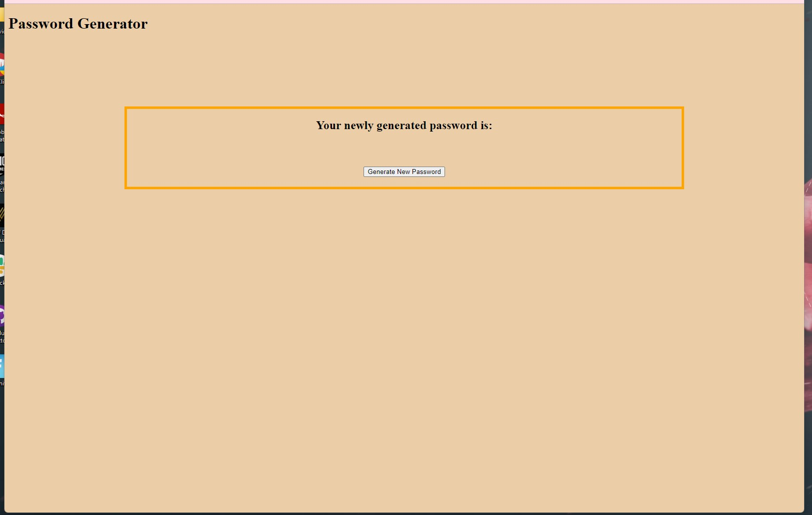
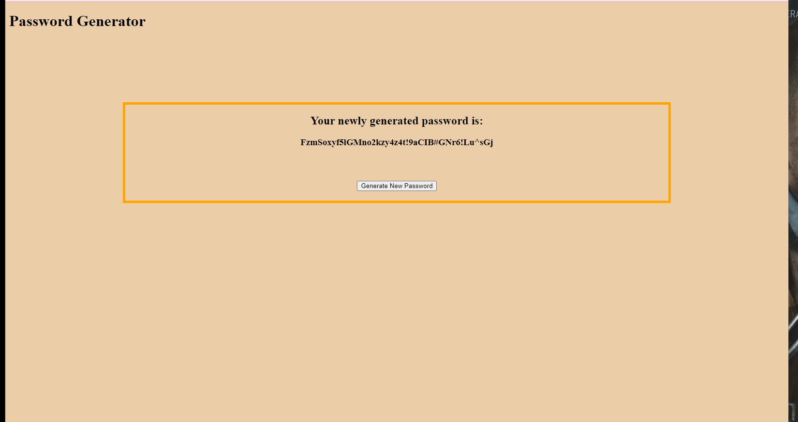

# PasswordGenerator

One paragraph of project description goes here.
This project's purpose is to allow users to generate a new and secure password that conforms to the user's accepted conditions which include lowercase, uppercase, numbers, and special characters. 

## Development

I first set up the html file with the basic content that I was needed, which was essentially some text and a button and added some basic styling. 

Next, when the button would be clicked, I then generate a prompt for the user on the desired password length and would check conditions to make sure that the number is between 8 and 128. After this, I would let the user confirm if the wanted uppercase letters, lowercase letters, numerals, and special characters and to make sure that atleast there would be 1 character of the desired criteria within the generated password. I would then scramble the first 4 characters of the password since the first 4 characters would always be a lowercase, uppercase, number, and then a special character in that order. Then the password would be displayed on the page.

## Built With

* [HTML](https://developer.mozilla.org/en-US/docs/Web/HTML)
* [CSS](https://developer.mozilla.org/en-US/docs/Web/CSS)
* [Javascript](https://developer.mozilla.org/en-US/docs/Web/JavaScript)

## Deployed Link

* [See Live Site](https://dazedchou.github.io/PasswordGenerator/)

## Authors

* **David Chou** 

- [Link to Portfolio Site](https://dazedchou.github.io/My-Portfolio/)
- [Link to Github](https://github.com/dazedchou)
- [Link to LinkedIn](https://www.linkedin.com/in/davidchou99)

## License

This project is licensed under the MIT License 

